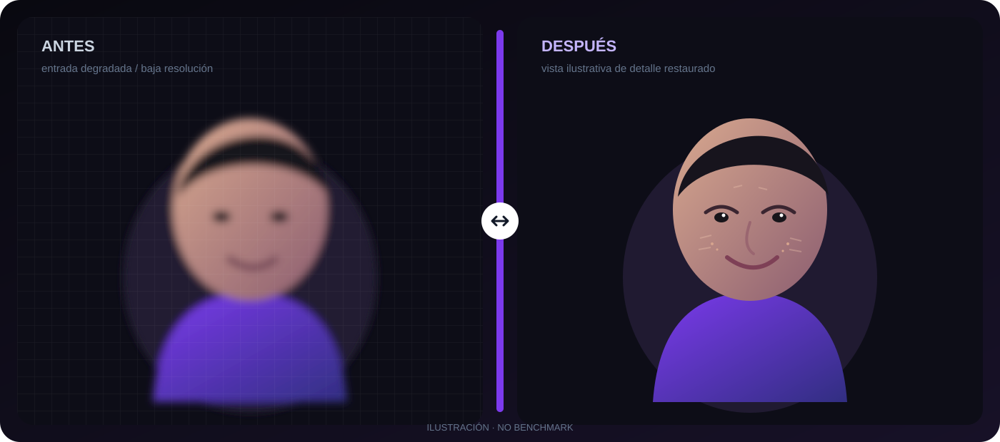
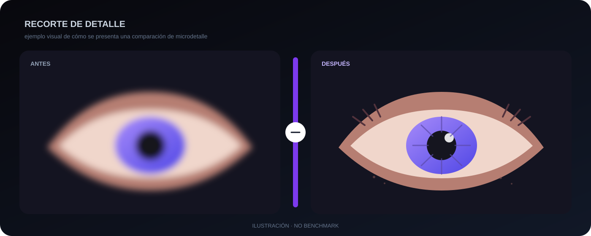

<div align="center">

# ProUpscaler

**Upscaling y restauración local de imágenes con Python, FastAPI, PyTorch y modelos especializados para retrato.**

[](https://www.python.org/)
[](https://fastapi.tiangolo.com/)
[](https://pytorch.org/)
[](./LICENSE)

</div>

ProUpscaler es una aplicación web local para **mejorar resolución, restaurar rostros y procesar lotes de imágenes** desde una interfaz en el navegador. El backend corre en tu propio equipo y utiliza Spandrel para cargar modelos de upscale/restauración sobre PyTorch.

La aplicación ofrece dos flujos: **GFPGAN Clásico**, que funciona con los modelos descargados automáticamente, y **PRO Edition**, pensado para `4xFaceUpDAT` con una segunda etapa opcional de detalle de piel.

## Vista antes / después





> **Importante:** estas dos imágenes son demostraciones visuales creadas para documentar la interfaz y el tipo de comparación antes/después. **No son benchmarks ni salidas reales de los modelos.** El resultado real depende del modelo instalado, la imagen de entrada, la escala y los parámetros utilizados.

La propia interfaz incluye un comparador interactivo antes/después para cada resultado procesado.

## Qué incluye

- Restauración facial con **GFPGAN v1.4**.
- Upscaling de fondo con **RealESRGAN x4** cuando se activa.
- Workflow **PRO** con `4xFaceUpDAT.pth`.
- Segunda etapa opcional con `1x-ITF-SkinDiffDetail-Lite-v1.pth`.
- Escala final **2× o 4×**.
- Límite de salida de **4096 px en el lado mayor** para reducir OOM y tiempos extremos.
- Procesamiento por tiles de 128 a 1024 px.
- Sharpen configurable en el flujo PRO.
- Salida JPEG, PNG o WebP.
- Cola de múltiples imágenes.
- Cancelación de trabajos.
- Descarga individual o ZIP.
- Logs de procesamiento en la propia interfaz.
- Comparador visual antes/después.
- Análisis opcional con **Gemini** para sugerir fidelidad, fondo y escala.
- Limpieza automática de archivos temporales.

## Workflows

| Workflow | Uso | Modelos |
| --- | --- | --- |
| **GFPGAN Clásico** | Restauración de rostros y, opcionalmente, mejora del fondo | `GFPGANv1.4.pth` + `RealESRGAN_x4plus.pth` para fondo |
| **PRO Edition** | Upscale orientado a retratos con detalle facial y sharpen | `4xFaceUpDAT.pth` + opcional `1x-ITF-SkinDiffDetail-Lite-v1.pth` |

Al arrancar, ProUpscaler usa GFPGAN si el modelo PRO no está instalado. Si detecta `4xFaceUpDAT.pth`, la interfaz habilita y selecciona automáticamente el workflow PRO.

## Arquitectura

```text
Browser
  │
  │  HTTP / JSON / multipart
  ▼
FastAPI
  ├── uploads/
  ├── job queue en memoria
  ├── thumbnails
  ├── GFPGAN / DAT / SkinDetail
  ├── ESRGAN de fondo
  └── output/
       └── PNG / JPEG / WebP / ZIP
```

El proyecto no necesita una base de datos. Los trabajos y el estado de la sesión viven en memoria mientras el proceso está activo.

## Requisitos

### Software

- Python **3.10 o superior**.
- Python 3.11 o 3.12 recomendado para máxima compatibilidad.
- pip.
- Navegador moderno.

### Hardware

Puede ejecutarse en CPU, pero los modelos grandes pueden ser lentos.

- **NVIDIA / CUDA:** opción recomendada para inferencia rápida.
- **Apple Silicon / MPS:** la aplicación detecta MPS, pero actualmente fuerza la inferencia principal a CPU por compatibilidad con los modelos utilizados.
- **CPU:** compatible, con tiempos de procesamiento mayores.

Para una GPU NVIDIA conviene instalar la build de PyTorch correspondiente a tu versión de CUDA siguiendo la guía oficial de PyTorch.

## Instalación rápida

### macOS / Linux

```bash
git clone https://github.com/jayroanghelo/Upscaler.git
cd Upscaler
chmod +x run.sh
./run.sh
```

`run.sh` crea `.venv`, instala las dependencias, descarga los modelos base que falten y abre:

```text
http://localhost:8765
```

### Instalación manual / Windows

```bash
git clone https://github.com/jayroanghelo/Upscaler.git
cd Upscaler

python -m venv .venv
```

Activación en Windows:

```powershell
.venv\Scripts\activate
```

Activación en macOS/Linux:

```bash
source .venv/bin/activate
```

Después:

```bash
python -m pip install --upgrade pip
pip install -r requirements.txt
python download_models.py
python app.py
```

## Modelos

Los pesos no se incluyen en Git.

### Descarga automática

```bash
python download_models.py
```

El helper descarga:

- `GFPGANv1.4.pth`
- `RealESRGAN_x4plus.pth`
- `RealESRGAN_x2plus.pth`

### Modelos PRO

Para activar PRO Edition coloca manualmente en `models/`:

```text
models/
├── 4xFaceUpDAT.pth
└── 1x-ITF-SkinDiffDetail-Lite-v1.pth   # opcional
```

Los pesos de terceros **no están incluidos ni relicenciados por este repositorio**. Revisa siempre la licencia y las condiciones de uso del modelo original antes de redistribuirlo o utilizarlo comercialmente.

## Uso

1. Arranca ProUpscaler.
2. Abre `http://localhost:8765`.
3. Arrastra una o varias imágenes.
4. Selecciona el workflow.
5. Elige 2× o 4×.
6. Ajusta fidelidad, fondo, sharpen y tile size según el workflow.
7. Pulsa **Procesar imágenes**.
8. Compara el antes/después y descarga el resultado.

### Fidelidad en GFPGAN

La interfaz usa un control de 0.1 a 1.0:

- Valores bajos: priorizan reconstrucción.
- Valores medios: equilibrio.
- Valores altos: conservan más la imagen original.

### Tile size

Un tile pequeño consume menos memoria pero añade overhead.

| Tile | Uso aproximado |
| ---: | --- |
| 128–256 | VRAM/RAM limitada |
| 512 | equilibrio recomendado |
| 768–1024 | hardware con más memoria |

## Límite 4K

`MAX_OUT_DIM = 4096`.

Si el tamaño de salida solicitado superaría 4096 px en el lado mayor, la aplicación reduce la entrada o la escala efectiva antes de la inferencia. Esto evita intentar generar imágenes excesivamente grandes de forma accidental.

## Gemini opcional

Gemini **no es necesario** para procesar imágenes.

Si añades una API key desde la interfaz, Gemini analiza la imagen y puede recomendar:

- escala 2× / 4×;
- fidelidad;
- si conviene mejorar el fondo.

### Privacidad de Gemini

Sin Gemini, el procesamiento principal es local.

Cuando activas el análisis Gemini, **la imagen analizada se envía a la API de Google** para obtener la recomendación. La API key se mantiene en memoria durante la ejecución del servidor y en el estado de la pestaña; no se guarda en archivos del repositorio.

No publiques tu API key ni la añadas al código.

## Seguridad de ejecución

Por defecto el servidor escucha únicamente en:

```text
127.0.0.1:8765
```

Esto evita exponer la API accidentalmente a otros equipos de la red local.

Para cambiarlo:

```bash
PROUPSCALER_HOST=0.0.0.0 PROUPSCALER_PORT=8765 python app.py
```

Si expones la aplicación fuera de localhost, añade autenticación y un proxy HTTPS: la API no está diseñada como servicio público multiusuario.

## Workflow de ComfyUI

El repositorio incluye:

```text
Upscale-workflow.json
```

Es un workflow complementario para ComfyUI con:

1. carga de imagen;
2. `4xFaceUpDAT`;
3. detalle de piel 1×;
4. reescala Lanczos;
5. sharpen;
6. preview y guardado.

No es necesario para ejecutar la aplicación FastAPI.

## API local

| Método | Ruta | Función |
| --- | --- | --- |
| GET | `/` | interfaz web |
| GET | `/api/info` | dispositivo y modelos disponibles |
| POST | `/api/upload` | subir imágenes |
| POST | `/api/process` | iniciar trabajo |
| GET | `/api/status/{job_id}` | consultar progreso |
| POST | `/api/jobs/{job_id}/cancel` | cancelar |
| DELETE | `/api/jobs/{job_id}` | eliminar trabajo |
| GET | `/api/download/{job_id}/{file_id}` | descargar resultado |
| GET | `/api/download-all/{job_id}` | descargar ZIP |
| POST | `/api/analyze` | análisis Gemini opcional |

## Estructura

```text
Upscaler/
├── app.py
├── download_models.py
├── requirements.txt
├── run.sh
├── Upscale-workflow.json
├── static/
│   └── index.html
├── models/
│   └── put_esrgan_and_other_upscale_models_here
├── docs/
│   └── images/
│       ├── before-after-portrait.svg
│       └── before-after-detail.svg
├── uploads/          # runtime, ignorado por Git
├── output/           # runtime, ignorado por Git
└── thumbs/           # runtime, ignorado por Git
```

## Detalles técnicos

- FastAPI + Uvicorn.
- PyTorch.
- Spandrel.
- FaceXLib.
- OpenCV.
- Pillow.
- Vanilla HTML/CSS/JavaScript.
- Estado de jobs en memoria protegido con `threading.Lock`.
- Procesamiento secuencial por job.
- Caché de modelos cargados en el proceso.
- Limpieza periódica de temporales.

## Limitaciones conocidas

- No es un servicio multiusuario.
- Los trabajos desaparecen al reiniciar el servidor.
- El rendimiento depende mucho del modelo y del hardware.
- La detección/restauración de caras puede fallar con rostros muy pequeños, perfiles extremos u oclusiones.
- El workflow PRO requiere pesos adicionales no descargados automáticamente.
- Los resultados pueden introducir detalle reconstruido; no deben interpretarse como recuperación exacta de información que no existía en la imagen original.

## Licencia

El código de este repositorio se distribuye bajo **MIT License**. Consulta [LICENSE](./LICENSE).

Los modelos descargados o añadidos a `models/` pertenecen a sus respectivos autores y mantienen sus propias licencias.

---

<div align="center">

Creado por **[Jayro Anghelo](https://jayroanghelo.com)**.

</div>
